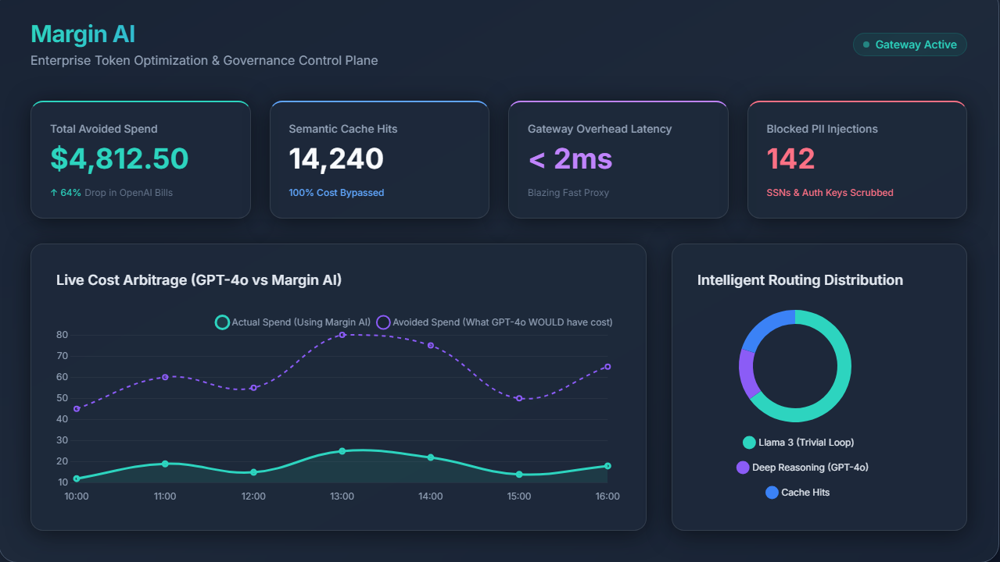
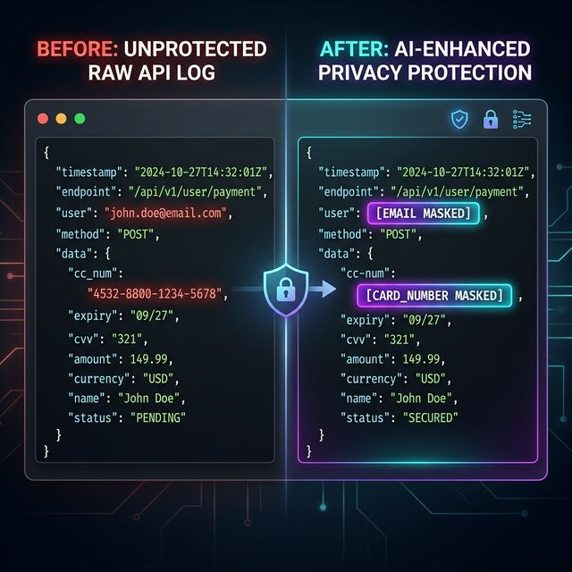
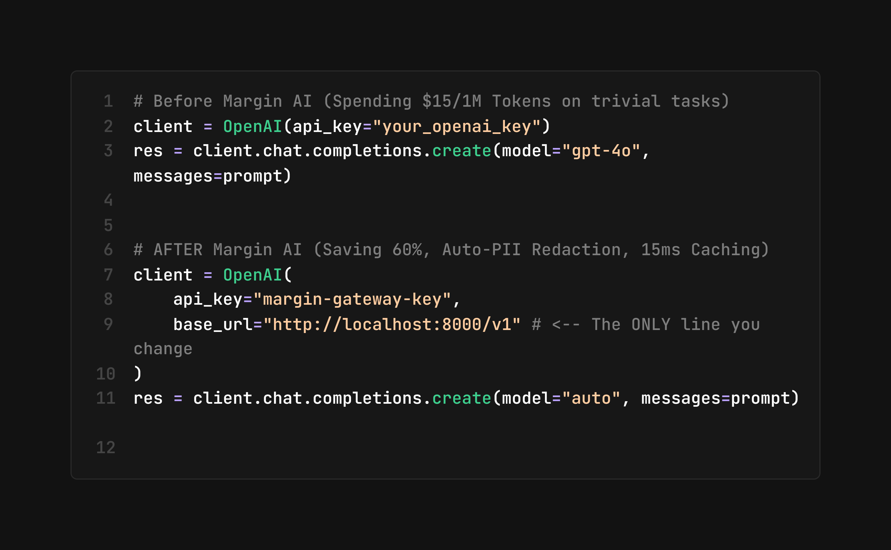

<div align="center">
  <h1>🛡️ Margin AI</h1>
  <h3>The Hardened Enterprise Gateway for Privacy & ROI.</h3>
  <p>Slash your AI token bill by 50%. Fix privacy in 1 line. Sub-ms vector search.</p>

  <p>
    <a href="https://www.loom.com/share/4c427add7c824902ab896af97fd77ab8">
      
    </a><br>
    <b><a href="https://www.loom.com/share/4c427add7c824902ab896af97fd77ab8">Watch the 2-minute Demo Video</a></b>
  </p>

  <p>
    <a href="#quick-start"><b>Get Started</b></a> •
    <a href="#problem"><b>Why Margin AI?</b></a> •
    <a href="#comparisons"><b>Comparisons</b></a> •
    <a href="#features"><b>Features</b></a>
  </p>

  <p>
    <a href="https://github.com/ramprag/margin_ai/stargazers"></a>
    <a href="https://github.com/ramprag/margin_ai/blob/main/LICENSE"></a>
    <a href="https://hub.docker.com/r/ramprag/margin_ai"></a>
  </p>
</div>

---

## ⚡ The Magic: Integration in < 10 Seconds

Margin AI is a **100% transparent, drop-in replacement gateway** that natively supports 100+ LLMs behind the unified OpenAI API standard. You don't need to rewrite your agent's complex logic or learn a new SDK.

Change exactly **ONE** line in your codebase to point to your local Margin AI Gateway:

### 🐍 Python (OpenAI SDK)
```python
from openai import OpenAI

client = OpenAI(
    api_key="your_margin_ai_key", # Margin securely handles your 100+ provider keys internally
    base_url="http://localhost:8000/v1"  # <-- Point to your local OR cloud Margin AI endpoint
)

# Your app magically gains PII Redaction, Caching, and Intelligent Routing
response = client.chat.completions.create(
    model="gpt-4o",  # Margin AI intelligently decides if it actually needs 4o
    messages=[{"role": "user", "content": "What is the capital of France?"}]
)
```

### 🦜🔗 LangChain
```python
from langchain_openai import ChatOpenAI

llm = ChatOpenAI(
    api_key="margin-ai-key",
    base_url="http://localhost:8000/v1", # <-- Point to your local OR cloud Margin AI endpoint
    model="claude-3-5-sonnet-20240620"   # Margin intelligently routes across providers
)
```

### 🌐 cURL
```bash
curl -X POST http://localhost:8000/v1/chat/completions \
  -H "Content-Type: application/json" \
  -H "Authorization: Bearer margin-ai-key" \
  -d '{
    "model": "auto",
    "messages": [{"role": "user", "content": "Hello!"}]
  }'
```

---

<a id="quick-start"></a>
## 🚀 Quick Start

Get the control plane and the real-time CFO dashboard running in your VPC in under 3 minutes.

```bash
# 1. Clone the repository
git clone https://github.com/ramprag/margin_ai.git
cd margin_ai

# 2. Add your Provider Keys
cp .env.example .env
# Edit .env and paste your keys (OpenAI, Groq, Gemini, Anthropic, etc.)

# 3. Boot the Control Plane
docker-compose up --build -d

# 4. View your Live Analytics Dashboard
open http://localhost:8000
```
*(Once running, point any AI SDK to `http://localhost:8000/v1`)*

---

<a id="problem"></a>
## 🔥 The Problem We're Solving

Building AI apps is easy. **Scaling AI unit economics is a nightmare.** 

If you are building a **multi-step autonomous agent** (like Manus, Devin, or deep-research agents), 80% of your LLM calls are **trivial background loops** (formatting JSON, parsing dates, extracting emails). 

If you send all of those invisible background loops to heavy models like `gpt-4o` or `claude-3-5-sonnet`, your token inference costs will explode. For most scaling startups, **the LLM token bill has already surpassed their AWS cloud hosting bill.**

**Margin AI is an enterprise infrastructure layer that acts as a transparent control plane inside your VPC.** It dynamically intercepts your backend traffic, serves exact matches from a cache, routes repetitive background tasks to lightning-fast fallback models (like Llama-3 via Groq), and automatically redacts sensitive PII from outbound payloads—saving you up to **60% on your total API bill** across 100+ models.

---

---

<a id="visual-tour"></a>
## 🖼️ Visual Tour

| **Real-time CFO Dashboard** | **Privacy Firewall (PII)** | **1-Line Integration Proof** |
| :---: | :---: | :---: |
|  |  |  |
| *Track Avoided Spend and ROI.* | *Redact PII before it hits the cloud.* | *Literally 1 line change.* |

---

<a id="features"></a>
## 🛡️ Enterprise Features

### 1. Dynamic Cost Routing (Intelligent Proxy)
Margin AI securely evaluates your payload's complexity **in-memory, entirely within your VPC**, before routing. 
*   **Deep reasoning task?** It dynamically routes to `gpt-4o`. 
*   **Trivial JSON formatting loop?** It immediately down-routes to `llama-3.1-8b-instant` on Groq. 
*   **Result:** Pay only for the intelligence you actually need. Slash token bills by 50% by avoiding the 'GPT-4o tax' on simple tasks.

### 2. Auto-PII Data Loss Prevention (DLP)
Selling to Enterprise/Healthcare? Agents reading local CRMs are a privacy nightmare. Margin AI automatically redacts sensitive customer data (SSNs, Credit Cards) across **full conversation histories** *before* the payload ever hits an external LLM API. 
*   **Result:** Instant SOC2/HIPAA compliance out of the box.

### 3. Hardened Semantic Caching (Sub-ms Latency)
Why pay for the exact same answer twice? Margin AI intercepts repetitive user queries and serves the response from an ultra-fast Redis cache combined with a **FAISS vector index** for sub-millisecond similarity search.
*   **Data Integrity:** Unlike basic caches, our FAISS implementation uses ID-mapping to ensure 100% data integrity with zero desync risk.
*   **Result:** 0 latency penalty, 100% token savings.

### 4. End-to-End Streaming Analytics
Most gateways lose visibility once you turn on `stream=true`. Margin AI captures token counts and cost ROI in real-time even for streaming payloads, ensuring your CFO dashboard is never out of sync.

### 5. Real-time CFO Analytics Dashboard
Stop guessing where your AI budget is going. The built-in dashboard tracks your **Avoided Spend**, Top Models, and Cache hit rates across 100+ LLM providers. Prove your ROI to investors and finance teams with real dollar-and-cent metrics.

### 6. Auto-Failover & High Availability
If Anthropic or OpenAI experiences an outage or throws a `429`, Margin AI automatically cascades the request to the next best provider mid-stream.
*   **Result:** Five-nines (99.999%) reliability for your agents.

---

<a id="comparisons"></a>
## 🥊 Margin AI vs. The World

Why not just use another AI Gateway like LiteLLM? Because generic routing layers require you to write massive custom logic just to save money, and SaaS gateways add latency while charging you extra.

Margin AI is specifically designed as an **Agent Cost-Control Layer**.

| Feature | Margin AI | LiteLLM | Cloudflare AI Gateway |
| :--- | :---: | :---: | :---: |
| **Pricing** | **100% Free / OSS** | Free OSS / Enterprise | Usage-based |
| **Core Focus** | **Agent Cost Optimization** | Universal API Formatting | Basic Rate Limiting |
| **Intelligent Routing** | ✅ Dynamic (Intent-based) | ⚠️ Manual (Rules-based) | ❌ No |
| **PII Redaction Engine** | ✅ Built-in & Automatic | ❌ Paid Enterprise Tier | ❌ No |
| **Data Privacy** | **Runs locally in your VPC** | Runs in your VPC | Hosted externally |
| **Added Latency** | **< 2ms** | < 5ms | ~50ms |
| **ROI Dashboard** | ✅ Live Avoided Spend Tracker| ⚠️ Basic Request Logs | ❌ Basic AI Logs |

**The Verdict:** If you want a basic gateway that universally formats API calls, use LiteLLM. If you want an intelligent control plane that **automatically slashes your multi-step agent bill in half** while keeping your PII securely in your VPC, use Margin AI.

---

## 🧪 Testing

Margin AI is built for reliability. You can run the professional test suite (including unit tests for FAISS and PII algorithms) via `pytest`:

```bash
# Register dependencies
pip install -r backend/requirements.txt
pip install pytest

# Run the suite
pytest tests/test_unit.py tests/test_integration.py
```

---

## 🏗️ Architecture

Margin AI is built for raw speed and enterprise reliability:
- **FastAPI Core:** Non-blocking async Python runtime capable of thousands of concurrent streams.
- **Universal Provider Engine:** Natively connects to 100+ global LLMs under the unified OpenAI spec.
- **Local Priority:** Deploys instantly via Docker. Absolutely zero data is sent to our servers.

<br>
<div align="center">
  <b>Built for AI Engineers who care about Unit Economics.</b><br>
  Star the repo to support open-source infrastructure. ⭐
</div>
